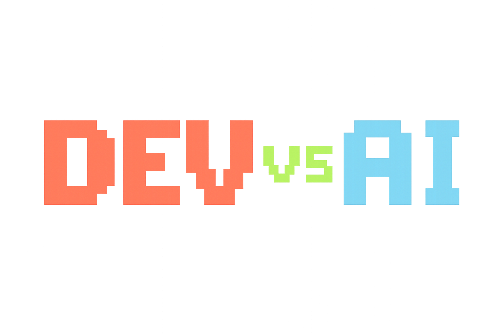

# Dev vs AI Game
A fun JavaScript game where a developer faces an AI to save their job.

# DEV vs AI  
🎮 [**Play the Game!**][https://montovani.github.io/game-ai-vs-developer/]

---

## 🧩 Description  
**DEV vs AI** is a browser game built with **HTML, CSS, and JavaScript**.  
You play as a developer trying to beat the AI by solving coding challenges.  
Move around the map, collect the right code cards, and survive each round!

---
## Main characters
- Dev

- AI

-Boss

## ⚙️ Main Functionalities  
- Code question and answer system with interactive cards  
- Player movement across a top-down map  
- Collision detection with game elements  
- Score and level progression  
- Difficulty selection screen  
- Game Over and Win screens  
- Player respawn with blinking animation  
- Randomized question and card order each round  

---
---

## 💻 Technologies Used  
- HTML5  
- CSS3  
- JavaScript (ES6)  
- DOM Manipulation  
- Classes and Objects   
- Collision logic  
- Git & GitHub for version control  

## 🪄 States (Game Screens)  
- Start Screen  
- Difficulty Selection  
- Game Screen (Map + Cards)  
- Game Over Screen  
- Victory Screen  

🕹️ **Made with love and too much coffee.**
